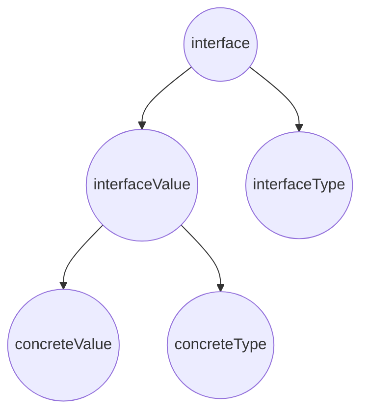

Что выведет программа? Объяснить вывод программы. Объяснить внутреннее устройство интерфейсов и их отличие от пустых интерфейсов.

```go
package main

import (
	"fmt"
	"os"
)

func Foo() error {
	var err *os.PathError = nil
	return err
}

func main() {
	err := Foo()
	fmt.Println(err)
	fmt.Println(err == nil)
}
```
**Ответ:**

Вывод:
```
<nil>
false
```

Разделим понятия статического (интерфейсного) и динамического (конкретного) типа.

В примере:
```go
var s Stringer // статический (интерфейсный) тип
s = time.Time{} // динамический (конкретный) тип
```
_Как мы выяснили в L1:_

Интерфейсный тип в Go — это своего рода _определение_. Он определяет и описывает конкретные методы, которые должны быть 
у _какого-то другого типа_.

Исходя из вывода программы в условии, можно сделать заключение, что значение переменной интерфейсного типа зависит от
значения и конкретного типа объекта, обернутого в интерфейсный тип.



Заглянув под капот, можно убедиться в вышесказанном:

### Непустой интерфейс
Непустой интерфейс под капотом описывают 2 структуры:

```go
type iface struct {
    tab  *itab
    data unsafe.Pointer
}
```

и

```go
type itab struct {
	inter *interfacetype
	_type *_type
	hash  uint32
	_     [4]byte
	fun   [1]uintptr
}
```

Всякий раз, когда мы создаем переменную интерфейсного типа, в нашей памяти создается соответвующая структура `iface`, 
в которой поле `data` ссылается на данные переменной конкретного типа, а tab ссылается на "таблицу" c данными, 
которая хранит в себе интерфейсный тип (поле `inter` в структуре `itab`), конкретный тип 
(поле `_type` в структуре `itab`), высчитанный хэш для быстрой отработки type assertion 
(поле `hash` в структуре `itab`), выравнивание для более эффективного испоользования памяти 
(поле `_` в структуре `itab`) и список методов, удовлетворяющих интерфейсу (поле `fun` в структуре `itab`).

`itab` - представляет собой своего рода ключ-значение, а именно соответствие статического типа динамическому. В больших 
программах типов и интерфейсов великое множество. И не все комбинации нужны. Для этого в Go компилятор создаёт 
несколько таблиц описания типов. В первой содержится список методов для конкретного интерфейса. Во второй, какие методы 
содержат динамические типы. `itab` - это соответствие между этими двумя таблицами. `itab` кэшируется после создания, так 
что это соответствие требуется вычислить только один раз в compile time.

Значение интерфейса будет `nil` только в том случае, если `data` (значение конкретного типа) и `_type` (конкретный тип) 
равны `nil` одновременно.

**Наглядный пример:**
```go
func Foo1() error {
	var err error
	return err
}
```

*Для переменной err в функции Foo1*

```go
func Foo2() error {
	var err *os.PathError
	return err
}
```

*Для переменной err в функции Foo2*

### Пустой интерфейс
Пустой интерфейс под капотом описывает следующая структура:
```go
type eface struct {
    _type *_type
    data  unsafe.Pointer
}
```

Легко заметить, что эта структура похожа на `iface`, но в ней нет таблицы интерфейса (`itab`). Что логично, потому что, 
по определению, любой конкретный тип удовлетворяет пустому интерфейсу.

**Наглядный пример:**
```go
func Foo3() interface{} {
	foo := int64(42)
	return foo
}
```

*Для переменной foo в функции Foo3*